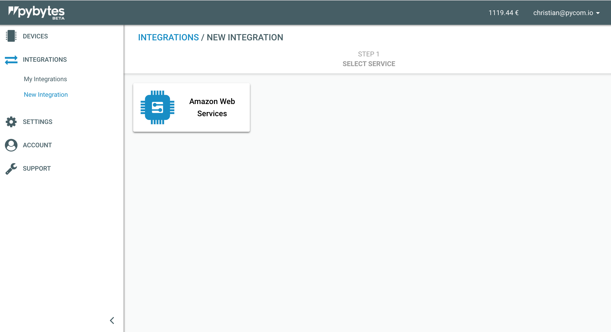
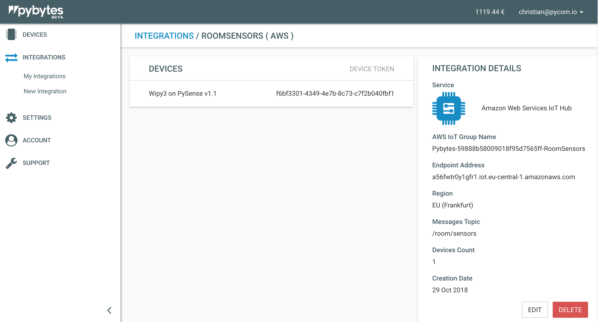

# Amazon IoT

Whenever one of your integrated devices sends a message to our broker, we republish the binary payload to the endpoint specified for its integration.
In order to save the data received by AWS, [you must set up a rule](https://docs.aws.amazon.com/iot/latest/developerguide/iot-rules.html). You can also test that everything's working with the [AWS IoT MQTT client](https://docs.aws.amazon.com/iot/latest/developerguide/view-mqtt-messages.html).

## Integrate your devices

1. Go in the sidebar, click on _New Integration_ and then on _Amazon Web Services_

2. Fill in the form choosing an [AWS region](https://docs.aws.amazon.com/AWSEC2/latest/UserGuide/using-regions-availability-zones.html) and your AWS credentials. You can optionally choose to save them inside the local storage for future use. Once you're done, click _Login_

3. In this step, you have to specify the [AWS group](https://docs.aws.amazon.com/iot/latest/developerguide/thing-groups.html) name (just alphanumeric letter, dashes and underscore are allowed), the custom topic and the devices you want to bind to AWS. When you're ready, click _Create_

4. If everything's worked as expected, you should be able to see a summary of your integration like the following:

